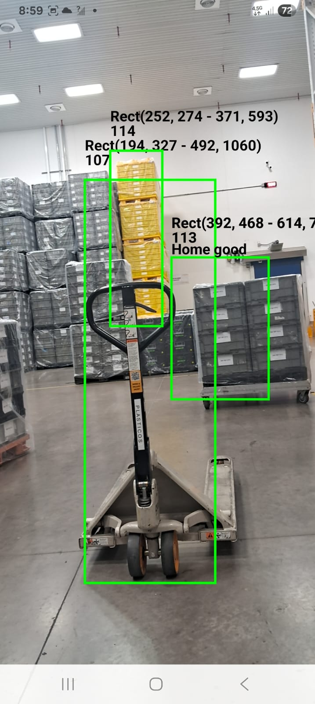
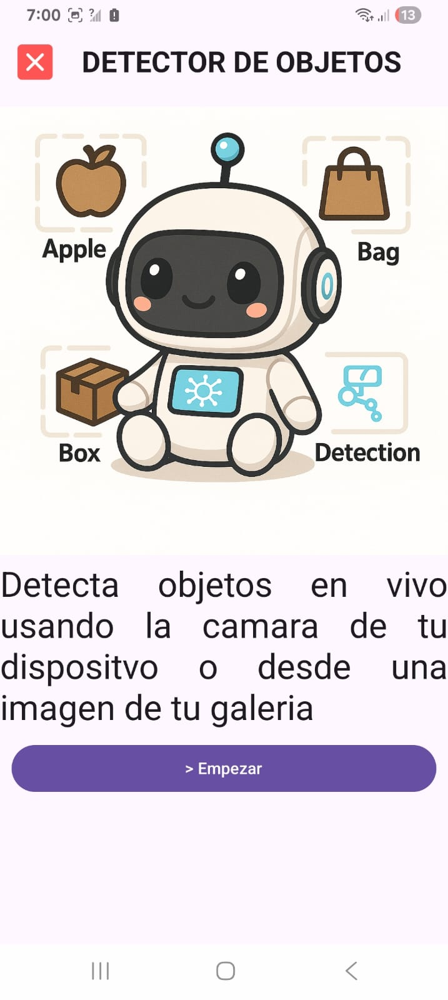

# 🤖 Detector de Objetos App

Bienvenido a la **aplicación de detección de objetos** en Android desarrollada con **Google ML Kit** y **Jetpack Compose**.  
Este proyecto combina visión por computadora y una interfaz moderna.

---

## 📄 Documentación

- [📂 Estructuras de código importantes](documentation/docs/desarrollo/codigo.md)
- [📘 Manual de usuario](documentation/docs/uso/manual-usuario.md)

---

## 🎯 Características principales

✔️ Detección de objetos en **tiempo real** con la cámara del dispositivo.  
✔️ **Etiquetado** de imágenes almacenadas en la galería.  
✔️ **Reconocimiento de texto (OCR)** en imágenes.  
✔️ Interfaz intuitiva y **responsiva** con Jetpack Compose.

---

## ⚙️ Funciones principales

### 🔴 Detección en vivo con la cámara

Permite identificar objetos en tiempo real usando la cámara trasera del dispositivo.

---

### 🖼️ Detección en tiempo real usando la camará del telefono.

Selecciona Camará en vivo y tendras acceso a la detección usando la camara de tu dispositivo.

<p align="center">
  
</p>

### 🖼️ Etiquetado de imágenes desde galería

Selecciona una imagen desde la galería y la aplicación genera etiquetas descriptivas.

<p align="center">
  
</p>

---

### 🔤 Detección de texto en imágenes

Extrae texto de imágenes seleccionadas desde la galería con tecnología OCR de ML Kit.

<p align="center">
  
</p>

---

## 🚀 Tecnologías utilizadas

- **Android Jetpack Compose** → interfaz moderna y declarativa.
- **CameraX** → integración nativa de la cámara.
- **Google ML Kit** → detección de objetos, etiquetas y OCR.
- **Room (SQLite)** → persistencia de datos local.
- **Hilt (Dagger)** → inyección de dependencias.
- **Kotlin Coroutines** → concurrencia segura y eficiente.

---

## 📌 Instalación y ejecución

1. Clonar el repositorio:
   ```bash
   git clone https://github.com/usuario/detector-objetos-app.git
   ```
2. Abrir el proyecto en **Android Studio** (versión Flamingo o superior).
3. Configurar un dispositivo/emulador con **Android 8.0 (API 26)** o superior.
4. Ejecutar la aplicación.

---

## 📷 Vista previa

Imágenes de muestra del funcionamiento de la aplicación:

<div align="center" style="display: flex; gap: 20px; justify-content: center; flex-wrap: wrap;">
  
  
  
</div>

---

## 🧑‍💻 Autor

Desarrollado por **Jesús Heriberto Torres Gil**  
📍 Chihuahua, México

---  

⭐ Si este proyecto te fue útil, ¡no olvides darle una estrella en GitHub!
