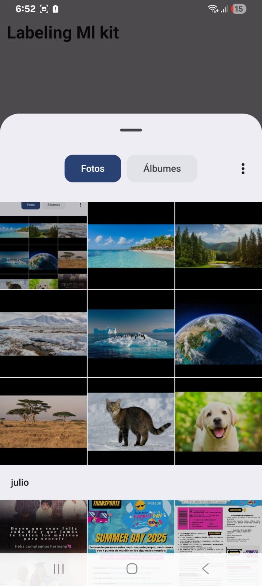
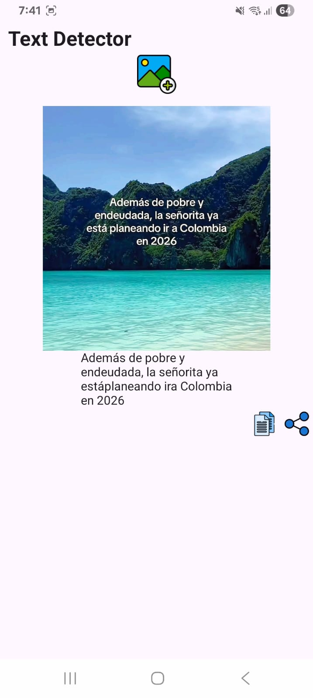
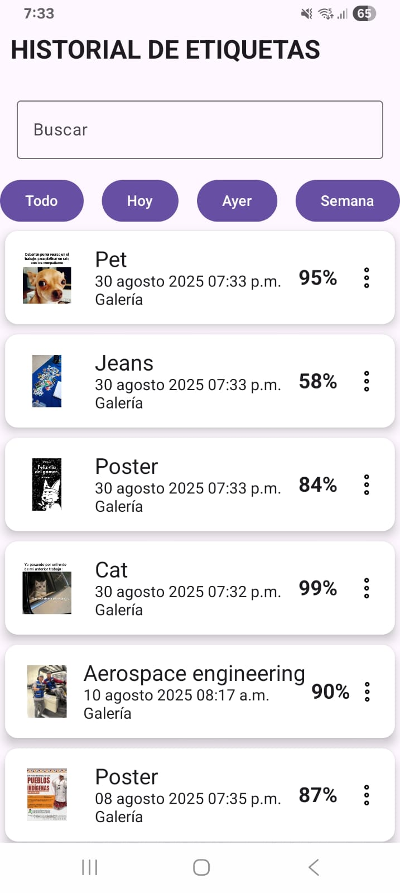
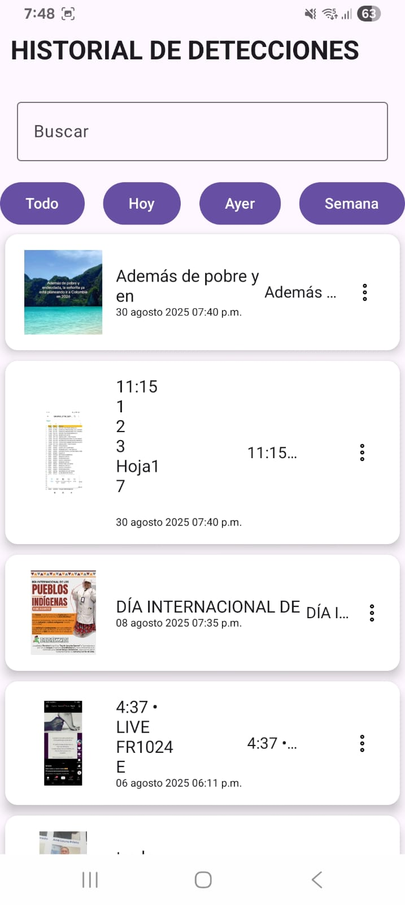

# 🖼️ Evidencias del funcionamiento

A continuación se presentan capturas de pantalla que muestran el funcionamiento de la aplicación.

---

## 1. Selección de imagen desde la galería

Esta pantalla muestra cómo el usuario puede seleccionar una imagen desde su dispositivo para procesarla con ML Kit.

  

---

## 2. Resultado del etiquetado automático

En esta captura se observa cómo se muestran las etiquetas generadas por ML Kit, junto con su nivel de confianza.

  

---

## 3. Resultado del detector de texto

En la siguiente captura se aprecia como el detector extrae el texto de la imagen.

  

---

## 4. Vista del historial detecciones

Aquí se muestra el historial de imágenes analizadas, recuperadas desde la base de datos local, de momento el historial esta en fase de prueba.

  

---

## 5. Vista del historial deteccion de texto

Aquí se muestra el historial de imágenes analizadas, recuperadas desde la base de datos local, de momento el historial esta en fase de prueba.

  

