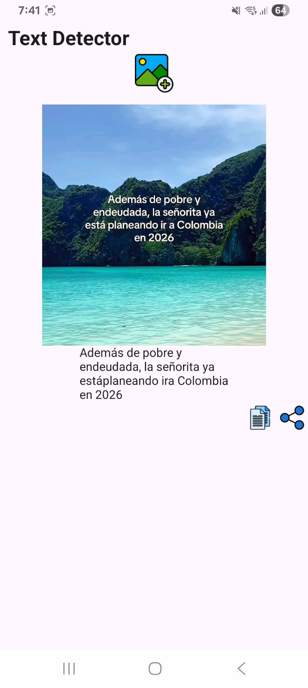
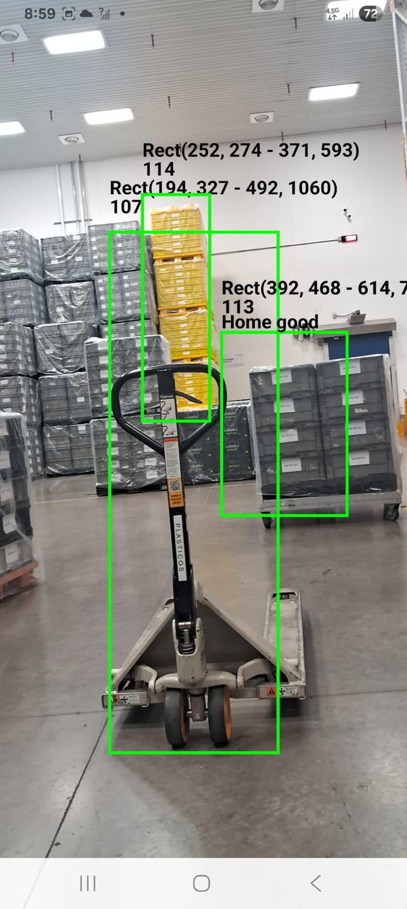

# Detector de Objetos App

Documentación de la aplicación de detección de objetos en Android con **Google ML Kit**.

## 📄 Secciones 

- [📂 Estructuras de código importantes](desarrollo/codigo.md)
- [📘 Manual de usuario](uso/manual-usuario.md)

---

## 🎯 Características principales

- Detección de objetos en tiempo real con la cámara del dispositivo.  
- Etiquetado de imágenes almacenadas en la galería.  
- Detección de texto en imágenes.  
- Interfaz amigable desarrollada con Jetpack Compose.  

---

## ⚙️ Funciones principales

### 🔴 Detección en vivo usando la cámara
La app muestra la cámara en vivo y procesa los objetos en tiempo real.

---

### 🖼️ Etiquetado de imágenes desde galería

  

---

### 🔤 Detección de texto en imágenes desde galería

  

### 🔤 Detección usando la camara en vivo

  

