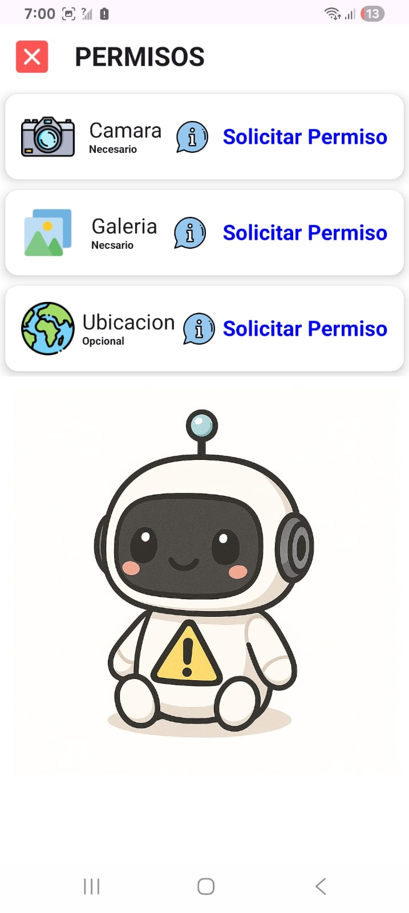
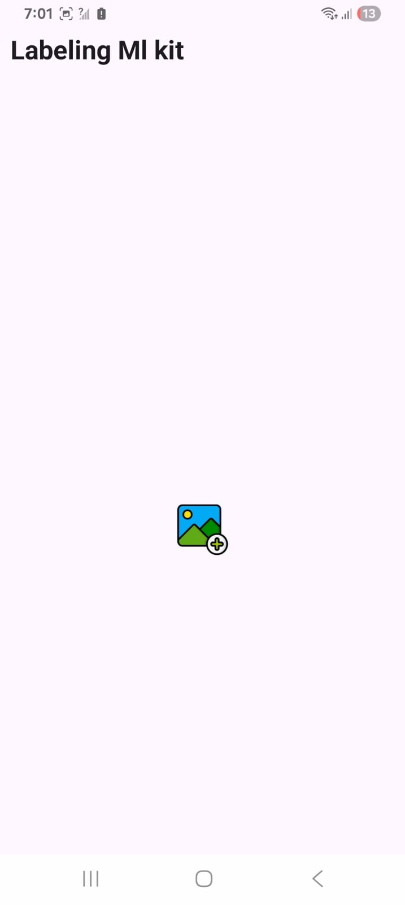

# Manual de Usuario

Esta sección presenta el flujo básico de uso de la aplicación para el etiquetado de objetos.

---

## 1. Solicitar permisos

La aplicación requiere permisos para **cámara**, **galería** y **ubicación** (opcional).

  

  

---

## 2. Pantalla de inicio

Pantalla inicial con acceso al botón **“Empezar”**.

---

## 3. Menú de opciones

Desde aquí se accede a todas las funcionalidades principales.

---

## 4. Historial de detecciones y etiquetados

Se puede consultar el historial de imágenes previamente **etiquetadas** y **texto detectado**.

---

## 5. Etiquetado desde galería

Pantalla donde se selecciona una imagen y se etiqueta con ML Kit.

### Ejemplos

1) **Seleccionar la imagen** a etiquetar o de la cual se extraerá texto:

2) **Imagen para extraer texto** (OCR):

3) **Imagen para etiquetar** (clasificación/etiquetado):

